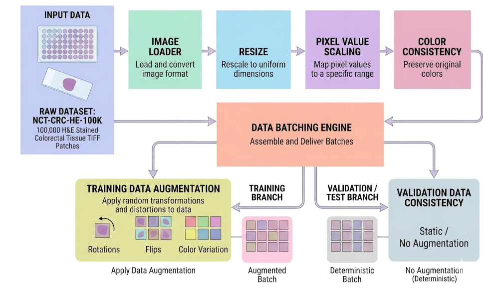
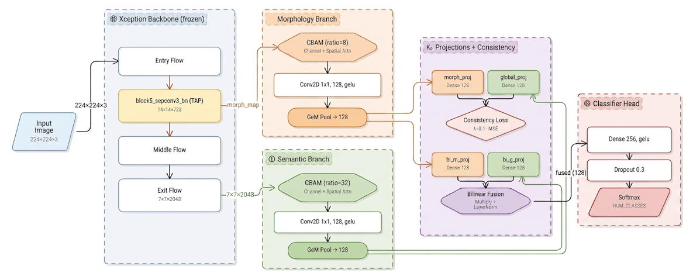
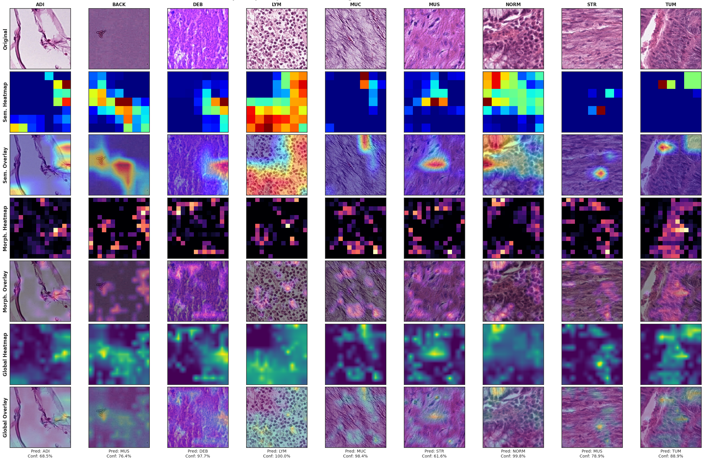
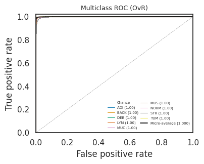
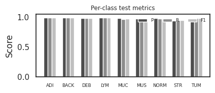
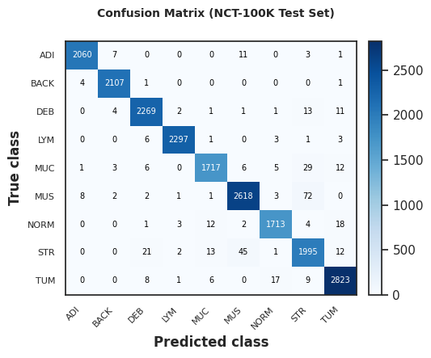

# Histopathology Cancer Cell Multiclass

> A research-first pipeline for multiclass histopathology classification, built to stress-test performance when stain normalization is removed.


## Overview
This repository contains the working notebook, visual assets, and paper-ready LaTeX materials for a multiclass histopathology cancer cell classification study on the NCT-CRC pipeline.

The project is centered on one practical question: how robust are model features when normalization is removed from the preprocessing stack? The current workflow keeps that question visible from data exploration through model evaluation and interpretation.

## Visual Snapshot

| Pipeline | Proposed Model | Interpretability |
|---|---|---|
|  |  |  |

| ROC Analysis | Internal Metrics | Confusion Matrix |
|---|---|---|
|  |  |  |

## What Makes It Worth Exploring
- Focuses on non-normalized histopathology inputs, which makes the experiment directly relevant to robustness.
- Keeps the notebook and figures aligned, so results are easier to trace and reproduce.
- Includes paper-oriented assets under `images/` and a dedicated IEEE LaTeX workspace.
- Supports both technical review and publication preparation without forcing you to switch context.

## Repository Layout
```
.
├─ images/                         # Figures, diagrams, and publication visuals
├─ nct_crc_nonorm_pipeline.ipynb   # Main notebook for the experiment
└─ README.md
```

## Recommended Workflow
1. Open `nct_crc_nonorm_pipeline.ipynb`.
2. Run the notebook from top to bottom.
3. Review the generated plots in `images/`.
4. Compare the baseline and proposed-model outputs.
5. Use the LaTeX folder when you are ready to assemble the paper.

## Current Research Direction
The study compares standard preprocessing assumptions against a no-normalization workflow, then evaluates whether the model can still preserve strong class separation and stable feature extraction. The figures in this repository are organized to support that story from EDA to final results.

## Reproducibility Notes
- Keep the dataset path stable across runs.
- Record the Python environment, GPU, and notebook version when generating new results.
- Save additional publication figures in `images/` so the README and paper stay synchronized.
- If you update the experiment, refresh the relevant visuals before drafting the manuscript.

## Citation
If this repository supports your work, please cite the GitHub repository directly:

```bibtex
@misc{histopathology_cancer_cell_multiclass,
	author       = {modhudeb},
	title        = {Histopathology Cancer Cell Multiclass},
	year         = {2026},
	publisher    = {GitHub},
	journal      = {GitHub repository},
	howpublished = {\url{https://github.com/modhudeb/histopathology-cancer-cell-multiclass}},
	url          = {https://github.com/modhudeb/histopathology-cancer-cell-multiclass}
}
```
